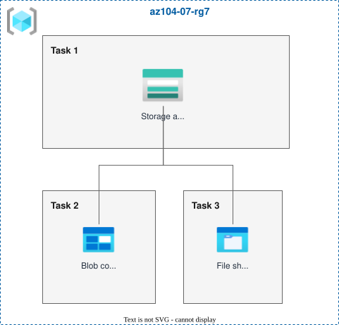
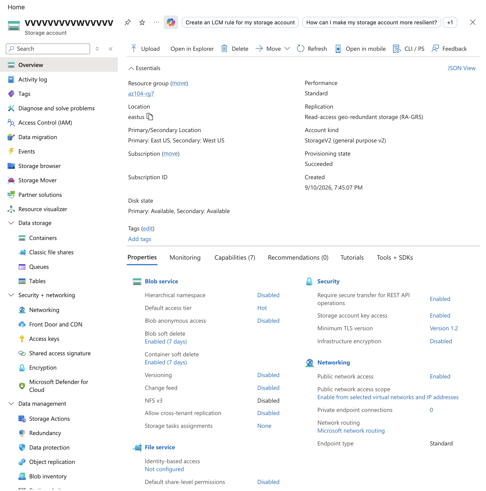
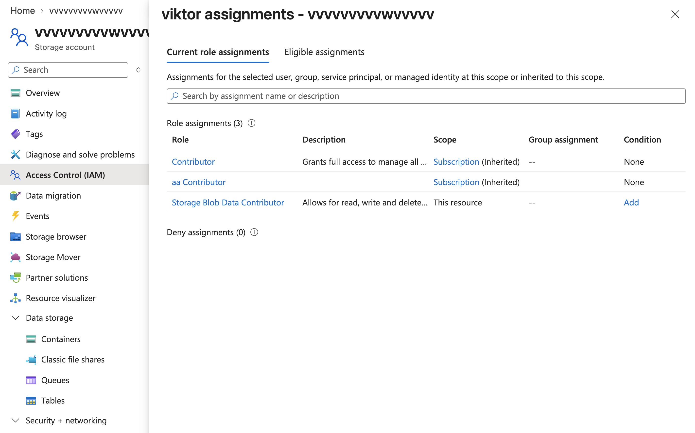
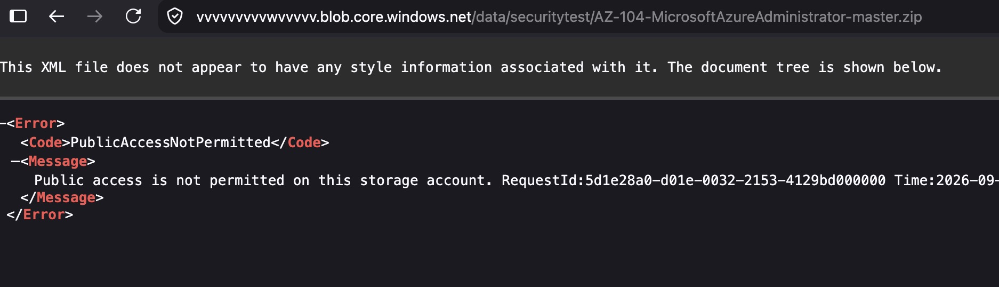
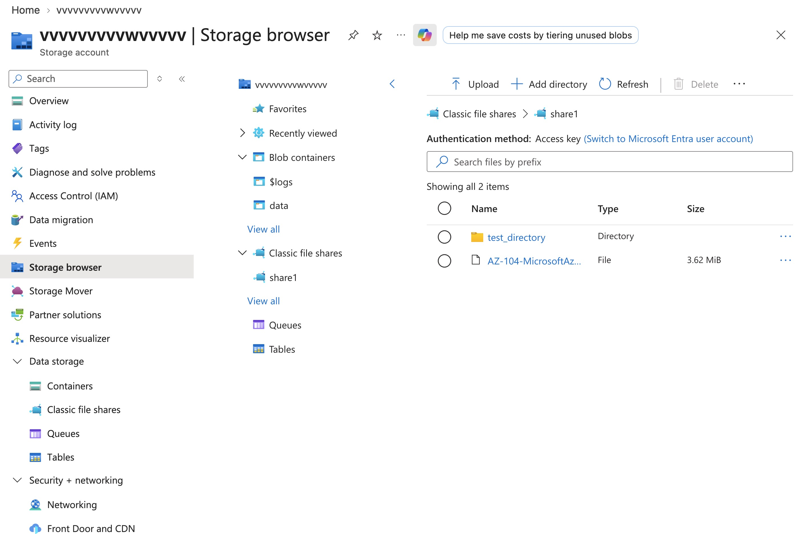
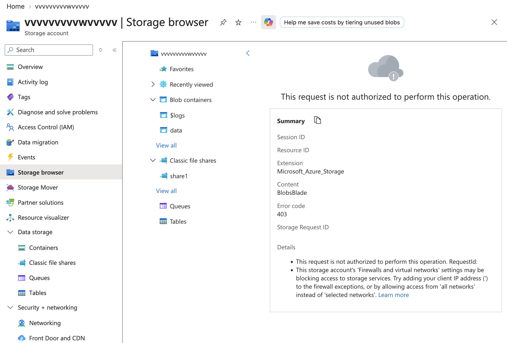

# Lab 07 - Manage Azure Storage

**Certification:** AZ-104  
**Module:** [Lab 07 - Manage Azure Storage](https://microsoftlearning.github.io/AZ-104-MicrosoftAzureAdministrator/Instructions/Labs/LAB_07-Manage_Azure_Storage.html)  
**Date completed:** 2026-09-10  

## Scenario

> _The organization stores data in on-premises data stores and wants to explore Azure Storage options. For security, redundancy, and availability."_

## Architecture

## What I Did

First, I created a storage account:

Then I had to give my account the roles `Storage Blob Data Contributor` and `Storage File Data Privileged Contributor` to be able to upload files:

I created a new blob container and uploaded a zip file. Accessing it from an icognito tab does not work since the access is restricted for the whole storage account:

For individual sharing of files there is a shared access signature (SAS), which is an URI that can be shared and allows limited access. With this, I could download the zip with a private tab.

Then I set up a classic share. For easy browsing, Azure has its "Storage browser":

In the beginning I restricted the storac account file acces to private and added my browser's IP address. Now I set up a virtual network and set it up that only from this network the storage account can be accessed.

Since my local browser is not from this network, I now get this error when trying to access the files from the Azure Storage Browser:

## Gotchas & Learnings

- **Problem:** Storae account name must be globally unique   
    **Takeaway:** I learned this earlier but it helps repeating it here. The storage account name must be globally unique because it's inserted into the url for the files. This way they can be accessed from everywhere without domain conflicts.
    
   

## Resources

- [GitHub lab instructions link](https://microsoftlearning.github.io/AZ-104-MicrosoftAzureAdministrator/Instructions/Labs/LAB_07-Manage_Azure_Storage.html)

 