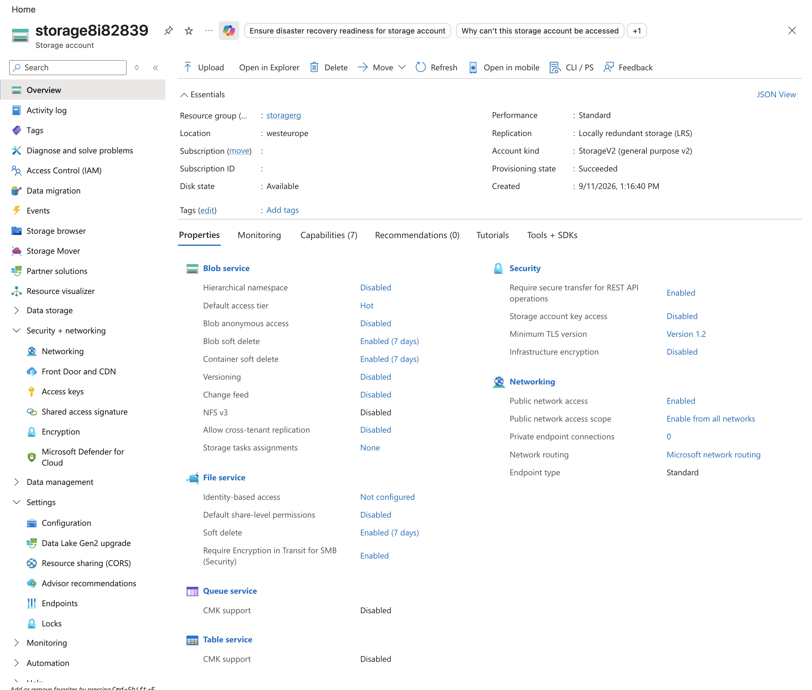
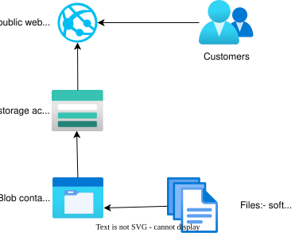
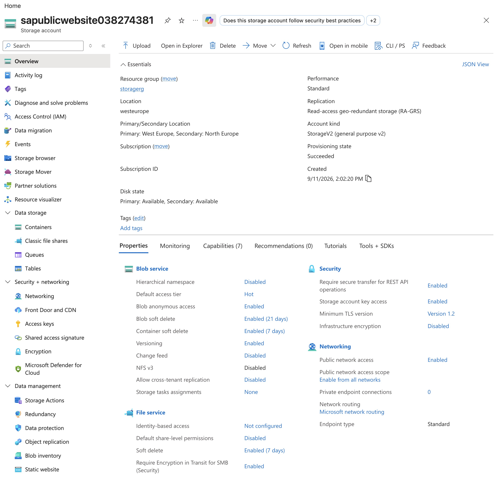
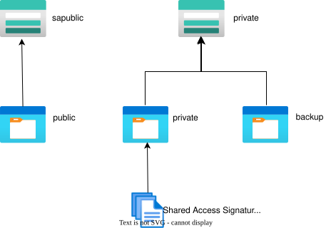
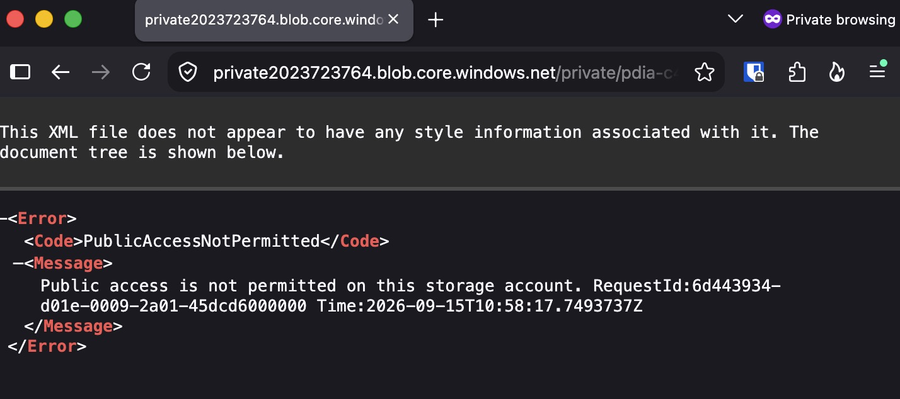
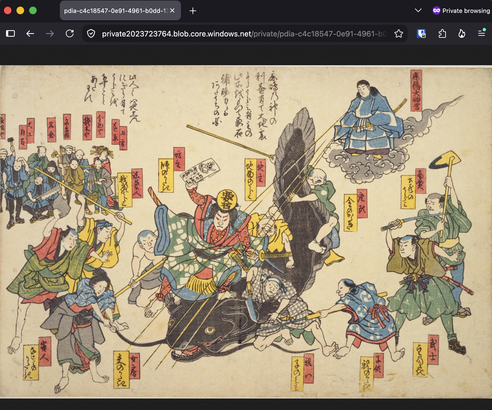
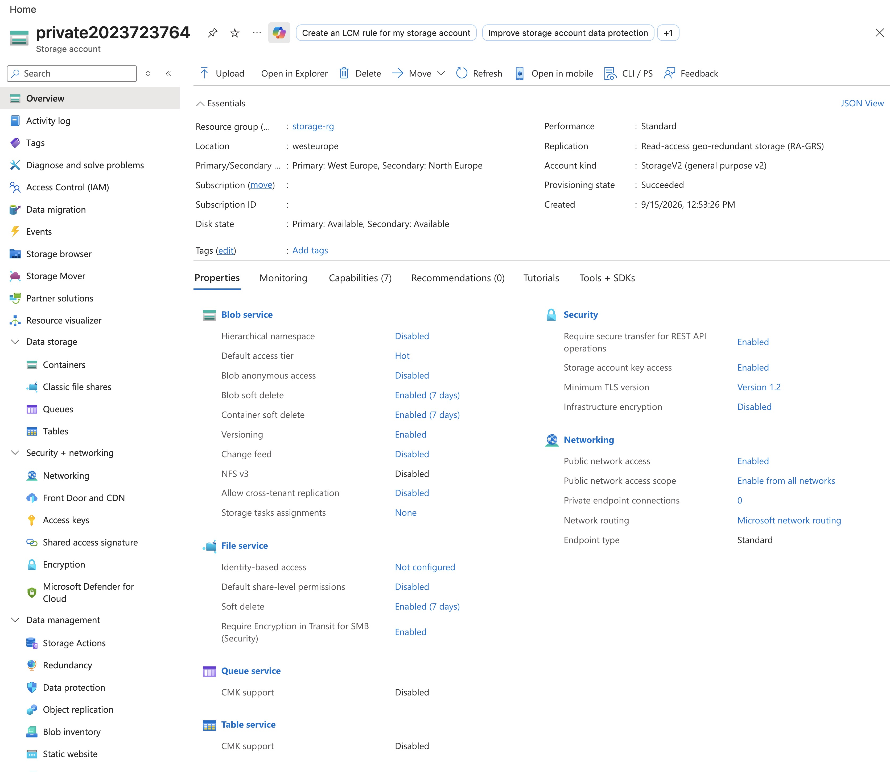
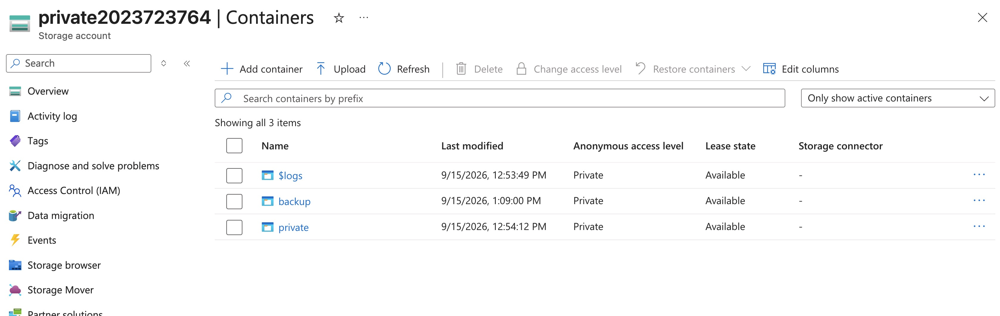
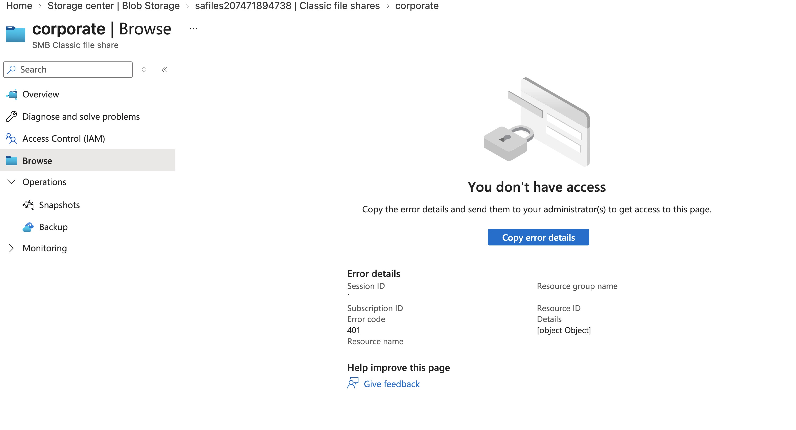

# Guided Project - Azure Files and Azure Blobs

**Certification:** AZ-104  
**Module:** [Guided Project - Azure Files and Azure Blobs](https://learn.microsoft.com/en-us/training/modules/guided-project-azure-files-azure-blobs/)  
**Date completed:** 2026-09-15  

## Scenario

> _In the company different departments have different needs for a storage solution. For each of the five cases, a different Azure solution is set up to adhere to the individual requirements._

## What I Did

The first scenario is a storage account for the IT department to prototype different storage scenarios and to train new personnel. It allows to use the lowest redundancy setting (locally reduntant), should only accept requests from secure connections, with a minimal TLS version 1.2 and disabled storage account key access, so that all access needs to be authenticated by MS Entra, like a service principal for automated services. And it should be available from public internet, not only from certain virtual networks:

---

The next scenario is to host binary files (blobs) for the public website. Those containt ad / info material that nees to be highly available and low latency. There are several ways to set it up, but for learning purposes we set up a storage account with a blob storage where the blobs are available by everyone from everywhere (which is usually not a good idea):

---

The next step is to set up a private storage account for internal documents and an automatic backup of the public website files. Partners can access individual files with a shared access signature (SAS)

Without the share, a partner can't access a file even if you share the file's URL:

But we can share individual files with a SAS (shared access signature) so a parnter can access the file even without logging in:

here's the overview of the storage account:

---

The next storage solution must be high performing and will be used to share important internal documents between geographically distributed locations. This is why it's a premium tier storage account:

We aloso want to restrict access to this file share to the company's virtual network. So even when signed into the Azure portal, I now get an error trying to access the file because I'm not on the Vnet:

## Gotchas & Learnings

    
- **Learning:** For a premium tier storage account one must choose between blob storage or classic file share, since premium tier storage accounts are specialized.    
    **Takeaway:** For different usages, one has to create several premium storage accounts each specialized.
    

## Resources

- [Microsoft Learn module link](https://learn.microsoft.com/en-us/training/modules/guided-project-azure-files-azure-blobs/)

