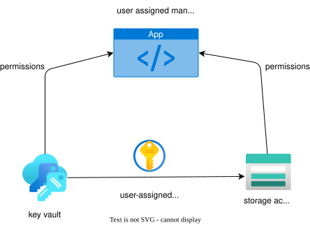
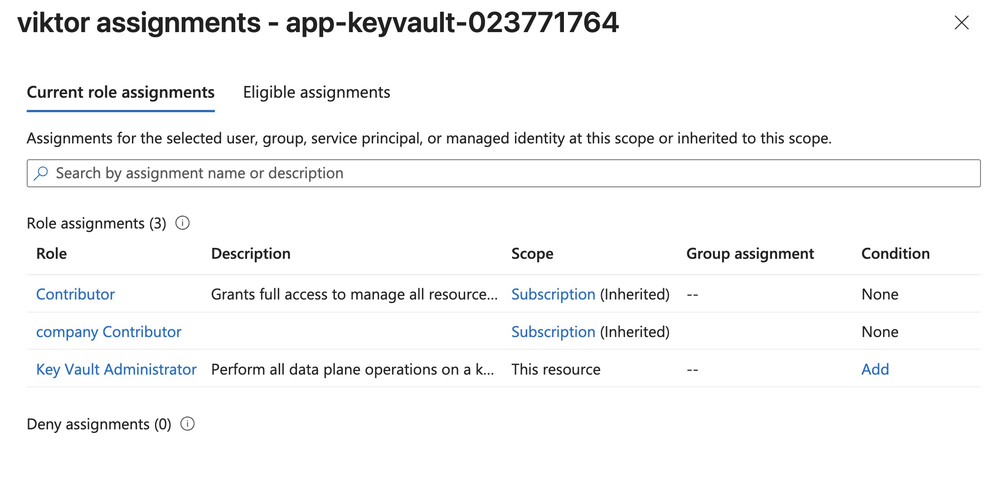
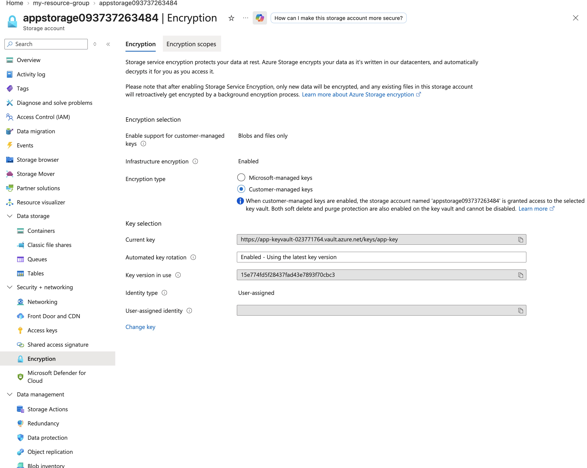
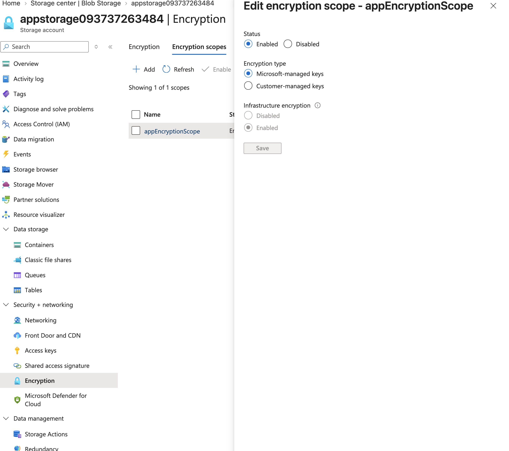
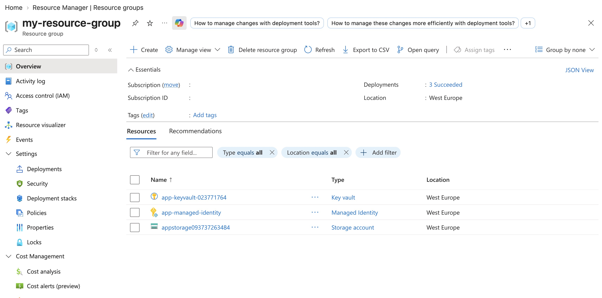

# Lab: Exercise 04: Provide storage for a new company app

**Certification:** AZ-104  
**Module:** [Exercise 04: Provide storage for a new company app](https://microsoftlearning.github.io/Secure-storage-for-Azure-Files-and-Azure-Blob-Storage/Instructions/Labs/LAB_04_storage_web_app.html)  
**Date completed:** 2026-09-16  

## Scenario

> _Here we want to create a storage for a new app. The storage needs to be accessed with azure RBAC roles and encrypted using keys managed by the devs._

## Architecture

## What I Did

After creating the storage account, I created a customer managed identity that will be used by the app, a key vault that stores the key that is used to encrypt the files in the storage account. 

In order to see and create a key in the key vault, I had to give myself the Azure RBAC role "Key Vault Administrator":

After giving the new identity the storage account's "Key Vault Crypto Service Encryption User", I could set up the infrastructure encryption with the newly created key in the key vault. 

The enabled toggle "Infrastructure encryption" is a second layer to the newly configured encryption at rest layer. Infrastructure encryption is fully managed by Azure, we can only enable or disable it, and it is used for defense in depth and for regulatory compliance.

In addition to the storage account wide encryption, we can set up encryption scopes, which define more granular encryption keys. This is useful for example for multi-tenant apps where each tenant gets their own encryption key.

Here's how the resource group looks like:

## Gotchas & Learnings

- **Learning:** Using managed identities is great because we don't have to manually manage credentials and can profit from Microsoft Entra features.
    **Takeaway:** Using managed identities is the best practice not only for human accounts but also for services and apps.
    
- **Problem:** After creating the key vault, the RBAC prohibited me to view and create the secrets, even though I'm a Contributor and just created the key vault.  
    **Fix:** I used the "Access Control (IAM)" blade to give me the correct role: "Key Vault Administrator"  
    **Takeaway:** The role Contributor allows one to manage the key vault, but not to access its contents. For that there are several built-in roles with Key Vault Administrator having the most permissions.
    
## Resources

- [GitHub lab instructions link](https://microsoftlearning.github.io/Secure-storage-for-Azure-Files-and-Azure-Blob-Storage/Instructions/Labs/LAB_04_storage_web_app.html)

