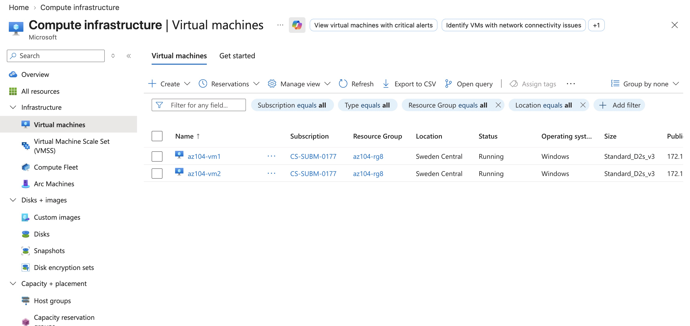
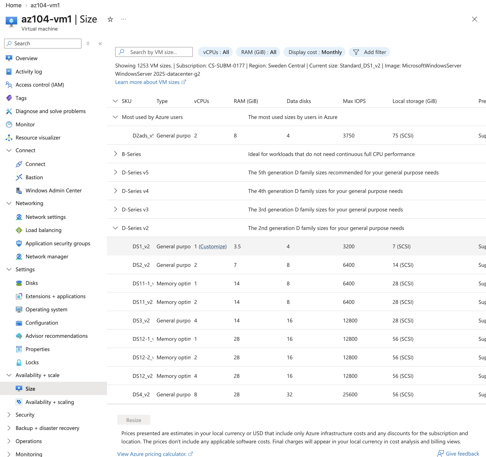
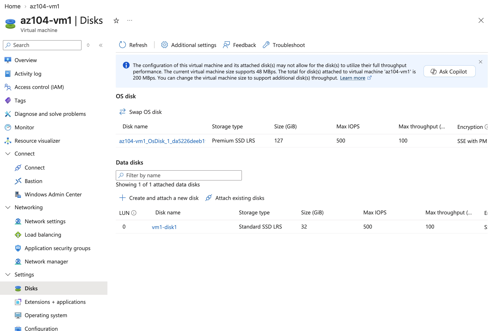
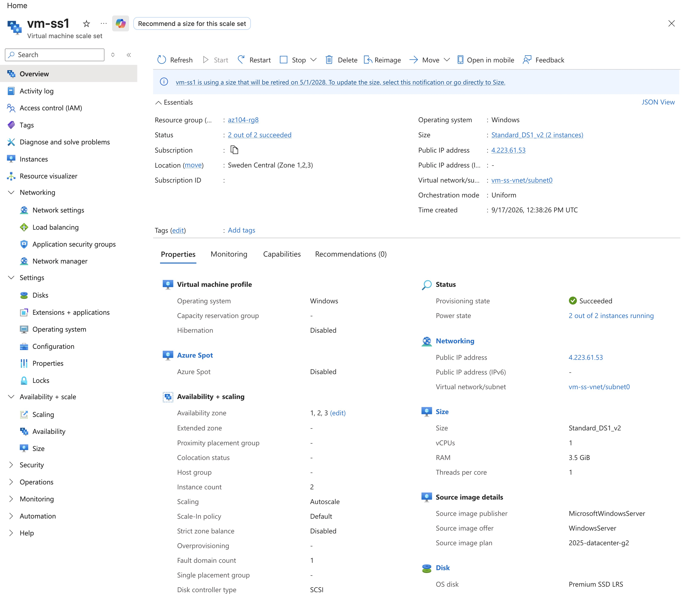
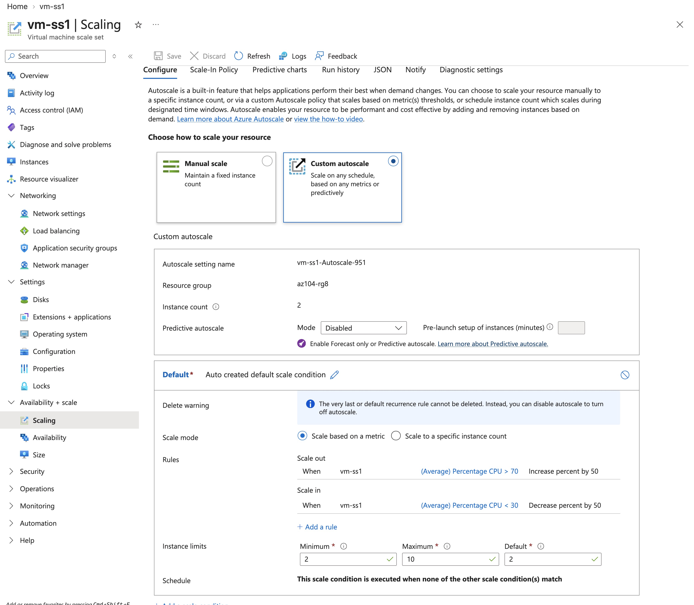
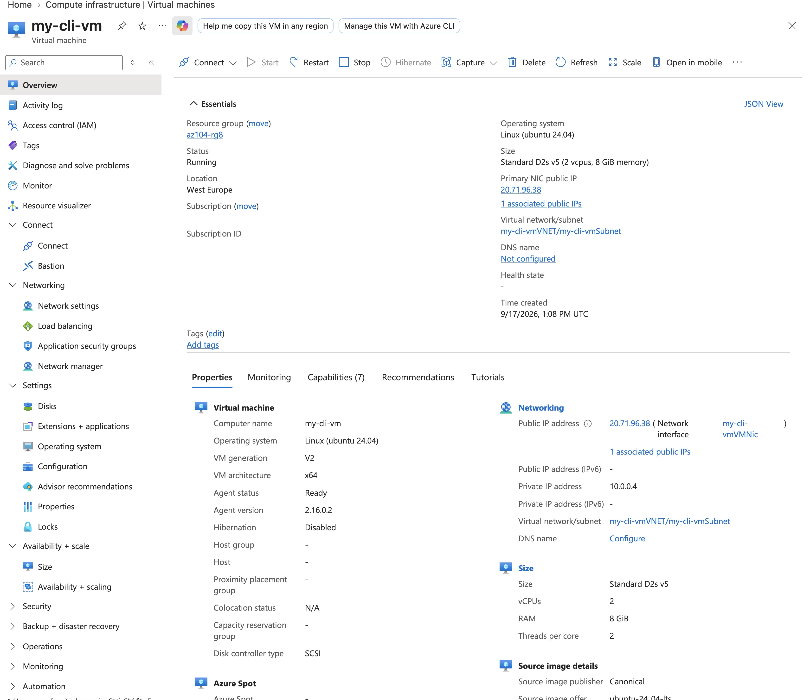
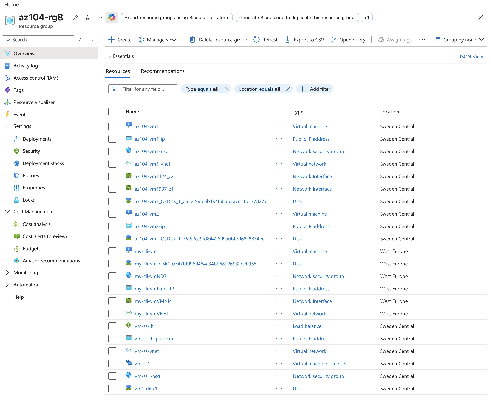

# Lab 08 - Manage Virtual Machines

**Certification:** AZ-104  
**Module:** [Lab 08 - Manage Virtual Machines](https://microsoftlearning.github.io/AZ-104-MicrosoftAzureAdministrator/Instructions/Labs/LAB_08-Manage_Virtual_Machines.html)  
**Date completed:** 2026-09-17  

## Scenario

> _Rewrite the lab's business context in your own words. Example: "Contoso Ltd needs to segment network access so the finance team's VMs cannot reach the dev team's VMs, while both can access a shared database subnet."_

## Architecture


_Editable source: diagram.drawio_

## What I Did

First I created 2 VMs. The new VM creation interface does not allow to create several ones in several availability zones (AZ). But there is a link to the legacy one, there one can select several AZs and this is just a convenient way to create several VMs with the same settings, but which operate indepentently of each other after creation.



After stopping and deallocating vm1, I could resize it to a different SKU and add a new virtual disk.






A more convenient option for managing VMs is to use a Scale Set, a set of Machines that can be scaled up or down. During creation one can specify a load balancer so that all the instances can be accessed from one IP address and be transparent to the user.



We can either manually set the number of instances, or define auto scale rules. Here The number of instances increases by 50% when average CPU load is more that 70% and decreases when the average CPU load is less than 30%.




---

The last step of this Lab is to create a VM with the Azure CLI:

```bash
az vm create --name my-cli-vm -g az104-rg8 --image Ubuntu2404 --admin-username localadmin --generate-ssh-keys
```

I did not specify the location of this VM and apparently it used the location of the resource group, West Europe in this case.



One can also deallocate the VM with the CLI:

```bash
az vm deallocate --resource-group az104-rg8 --name my-cli-vm
```


This is how the resource group looks like. The VMs come with a bunch of resources that are standalone Azure resources like Public IP address




## Gotchas & Learnings

- **Learning:** Using `--generate-ssh-keys` with `az vm create` creates ssh keys and stores them in the shell. This is very convenient to be able to quickly ssh into the Vm.  
    

## Resources

- [GitHub lab instructions link](https://microsoftlearning.github.io/AZ-104-MicrosoftAzureAdministrator/Instructions/Labs/LAB_08-Manage_Virtual_Machines.html)


