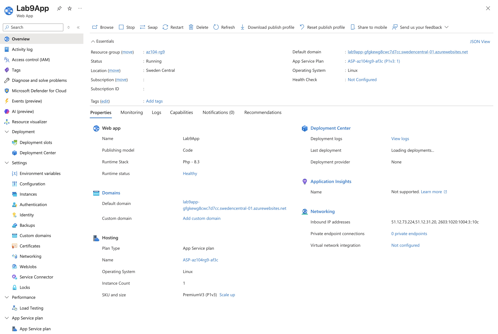
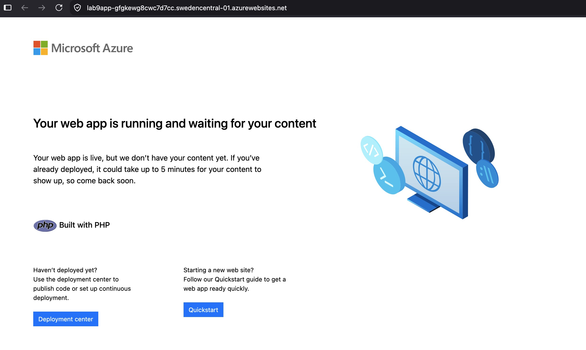
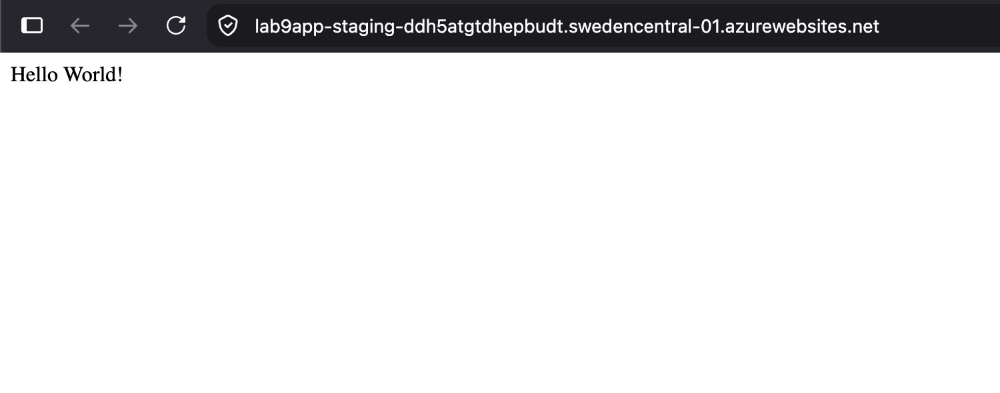
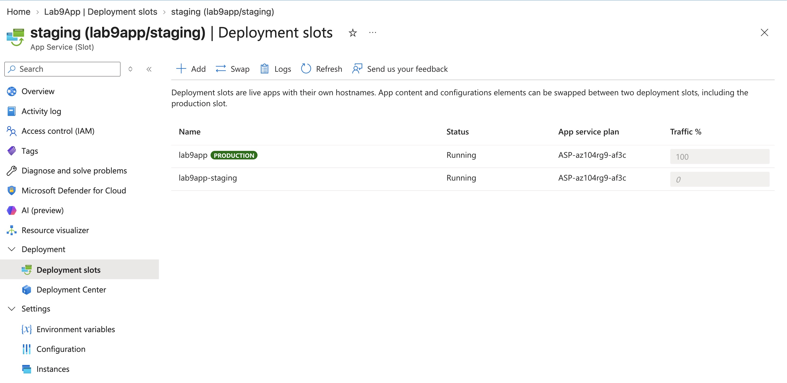
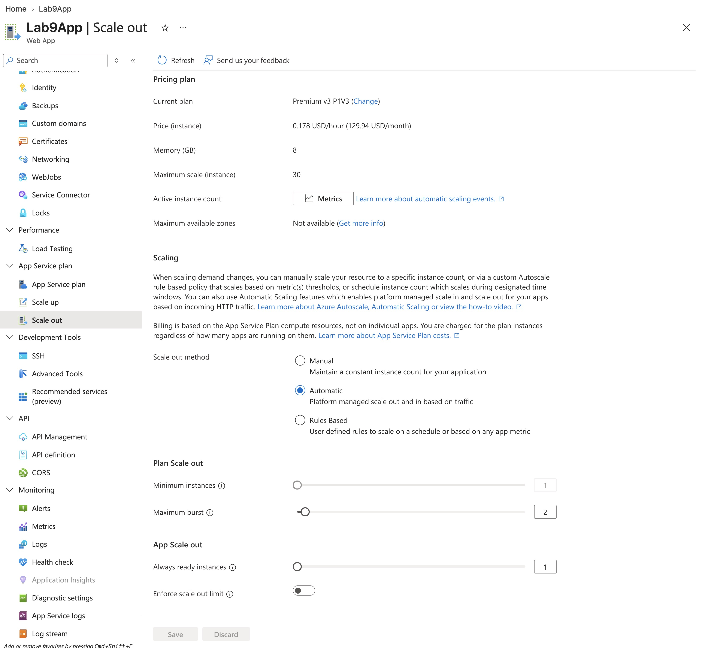
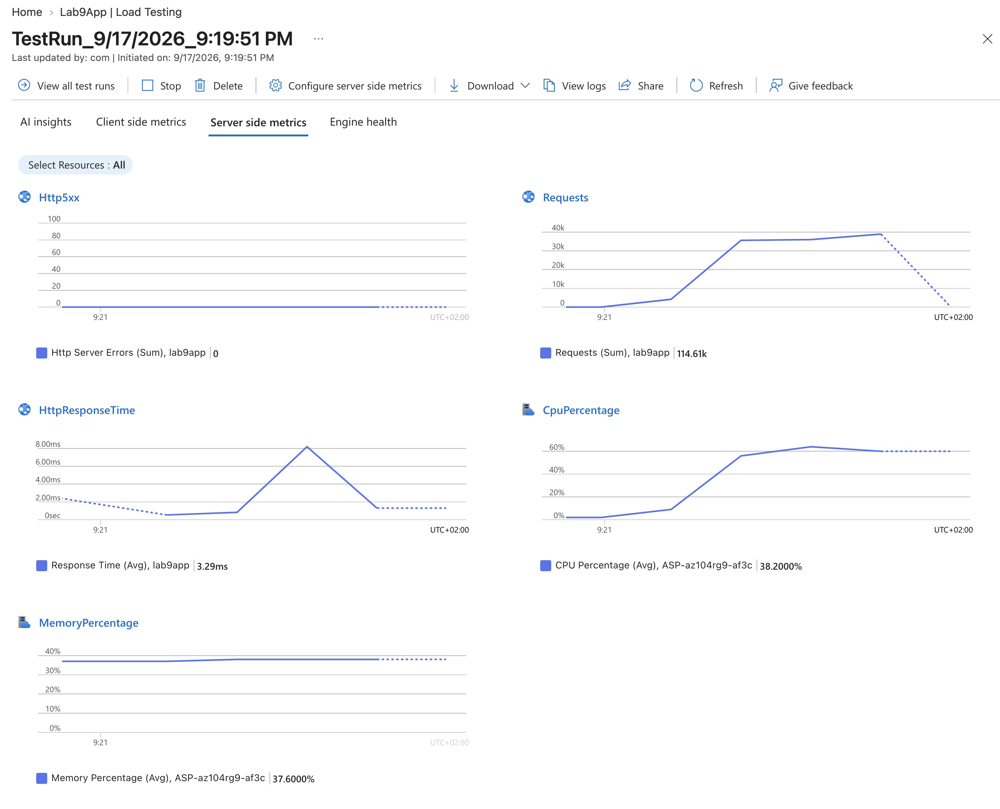
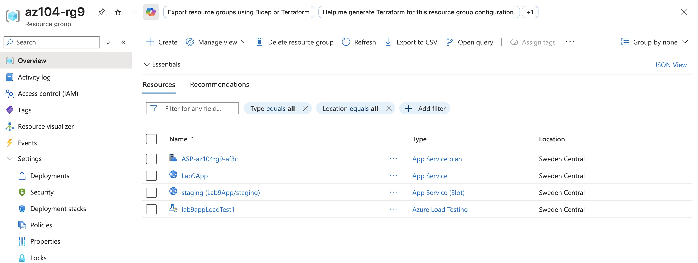

# Lab 09a - Implement Web Apps

**Certification:** AZ-104  
**Module:** [Lab 09a - Implement Web Apps](https://microsoftlearning.github.io/AZ-104-MicrosoftAzureAdministrator/Instructions/Labs/LAB_09a-Implement_Web_Apps.html)  
**Date completed:** 2026-09-17  

## Scenario

> The company is considering moving its websites from the on-premises servers to Azure. Staging and production slots are used and autoscaling is required. To minimize maintenance cost and time, Azure App Service is used instead of VMs.

## What I Did

I created the Web App in Azure using PHP 8.3 as the runtime:

Opening the url of the app gives this default screen:

To manage the deployment of the app in a granular way, there are the deployment slots one can use. I created a staging slot and set up its deployment to automatically deploy from a github repo, that was given in the Lab instructions. The deplyoment went through after a few minutes:

After making sure, this deployment of the staging slot works well, I swapped the staging slot to the production slot so that the production slot also now runs the updated app.

The next step is to set up auto scaling so that the app can scale with traffic

To test the auto scaling, I created and ran a load test. But with only one load test instance with 250 virtual users and ~700 requests per second, I could not put the app under heavy load, the CPU of the only instance only went up to ~60%. Since the app only serves a "hello world" php page, I guess that it's too optimized, like with nginx caching. Running a larger test would cost a lot more than running the app itself. So I just believe that it would actually scale to 2 instances when needed.

The resource group looks now like this:

## Gotchas & Learnings

This is my first time with Azure Web App Services, but it is cool to see Platform as a Service in action. No setting up and managing VMs and running web servers on them manually.
    

## Resources

- [GitHub lab instructions link](https://microsoftlearning.github.io/AZ-104-MicrosoftAzureAdministrator/Instructions/Labs/LAB_09a-Implement_Web_Apps.html)

