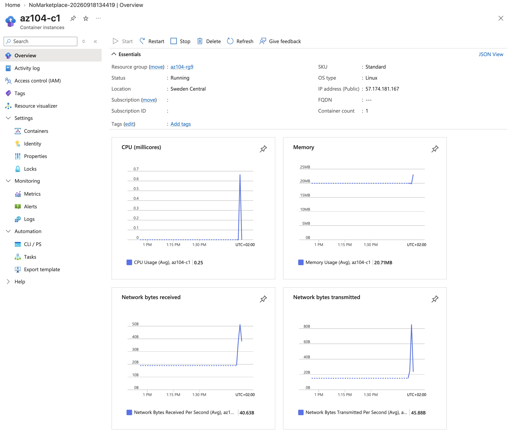
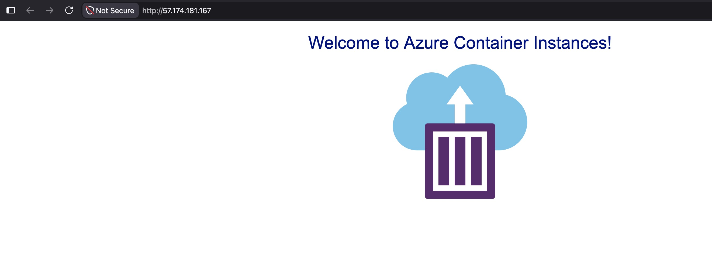
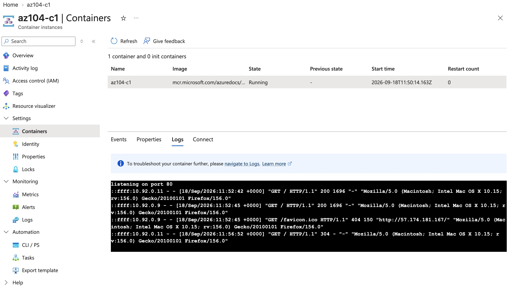

# Lab 09b - Implement Azure Container Instances

**Certification:** AZ-104  
**Module:** [Lab 09b - Implement Azure Container Instances](https://microsoftlearning.github.io/AZ-104-MicrosoftAzureAdministrator/Instructions/Labs/LAB_09b-Implement_Azure_Container_Instances.html)  
**Date completed:** 2026-09-18  

## Scenario

> The company wants to move a web application from on-premises to Azure and they want to do it via Docker images, but want to minimize maintenance, so Azure Container Instances are used.

## What I Did

To make a proof of concept, I created an Azure Container Instance with a qickstart image:

When accessing the app via the IP address we get this resopnse:

And in the container logs we see the timestamp of when I opened the page in the browser:

## Resources

- [GitHub lab instructions link](https://microsoftlearning.github.io/AZ-104-MicrosoftAzureAdministrator/Instructions/Labs/LAB_09b-Implement_Azure_Container_Instances.html)

