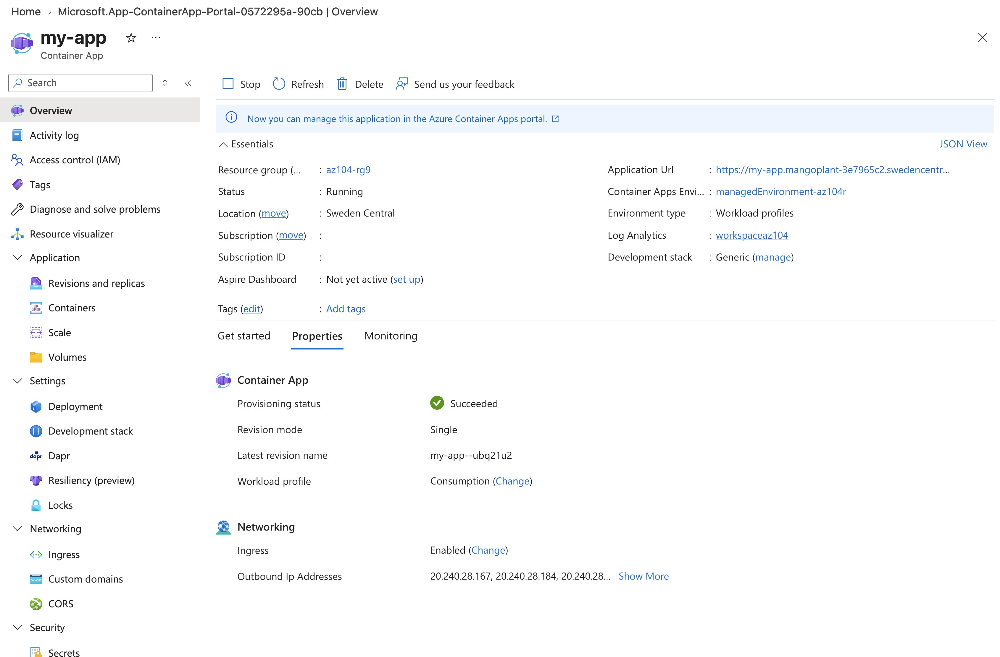
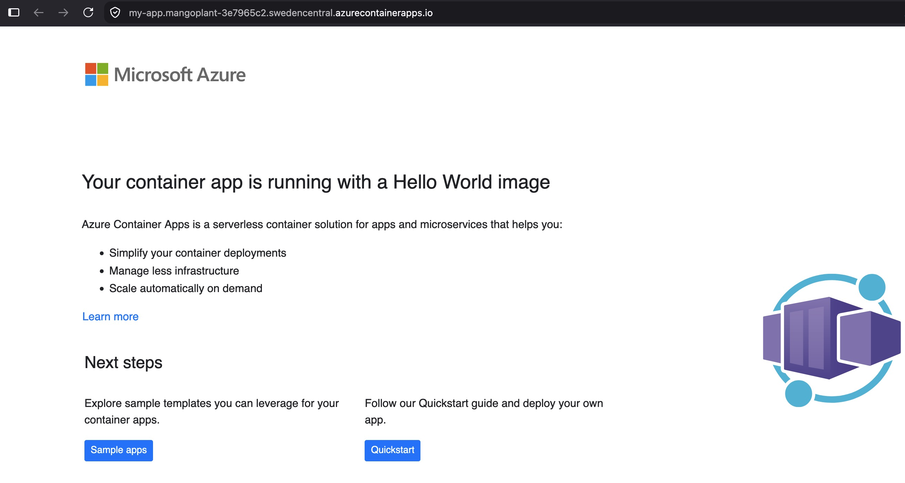
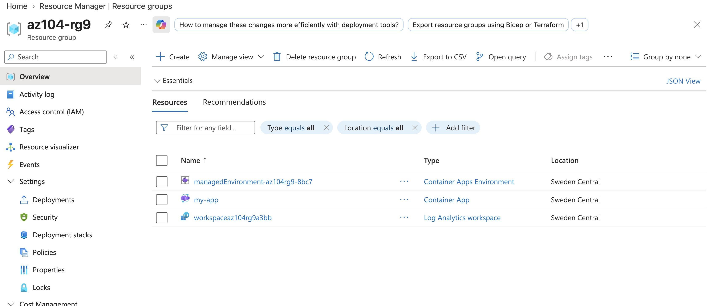

# Lab 09c - Implement Azure Container Apps

**Certification:** AZ-104  
**Module:** [Lab 09c - Implement Azure Container Apps](https://microsoftlearning.github.io/AZ-104-MicrosoftAzureAdministrator/Instructions/Labs/LAB_09c-Implement-Azure-Container-Apps.html)  
**Date completed:** 2026-09-18  

## Scenario

> The company wants to move a web application from an on-premises computer, which would have to be replaced, into the Azure cloud and evaluates the option of Azure Container Apps.

## What I Did

I created an Azure Container App using a quickstart hello world image

Here's the output of the app when viewed in the browser:

So we know the deployment worked.

Here's the resource group:

## Gotchas & Learnings

- **Problem:** There are many ways of hosting a web app on Azure, with more or less control for me as the user.  
    **Takeaway:** I will have to get more familiar with the differen options and their comparison.
    
    
## Resources

- [GitHub lab instructions link](https://microsoftlearning.github.io/AZ-104-MicrosoftAzureAdministrator/Instructions/Labs/LAB_09c-Implement-Azure-Container-Apps.html)

