# Lab 10 - Implement Data Protection

**Certification:** AZ-104  
**Module:** [Lab 10 - Implement Data Protection](https://microsoftlearning.github.io/AZ-104-MicrosoftAzureAdministrator/Instructions/Labs/LAB_10-Implement_Data_Protection.html)  
**Date completed:** 2026-09-22  

## Scenario

> The company's apps run on VMs that are critical for business, so we want to set up regular automatic backups and also a backup solution that allows one to run the VMs even if the main Azure region goes down.

## What I Did

I started by peplyoing the starting rescources from a given json template:
```bash
az deployment group create -g az104-rg-region1 --template-file az104-10-vms-edge-template.json --param
eters az104-10-vms-edge-parameters.json
```

Here's how the resource group looks like after deployment:

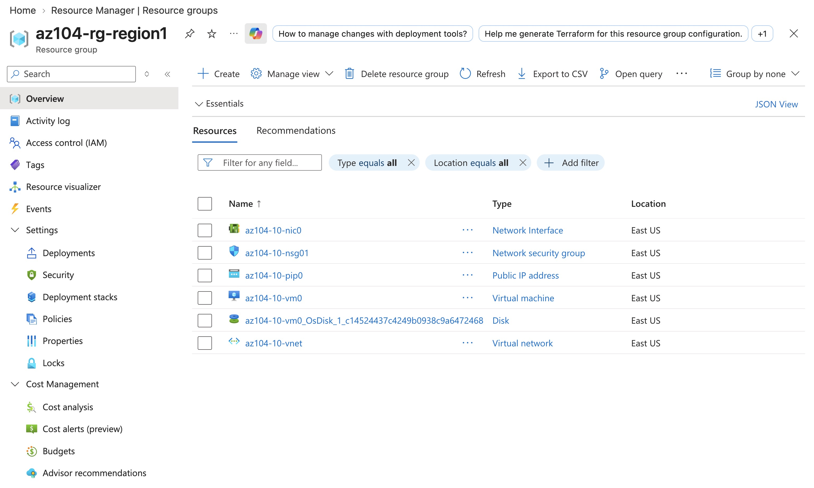

Then I created a Recovery Services Vault, and after the deployment finished, I made sure the following settings were set:

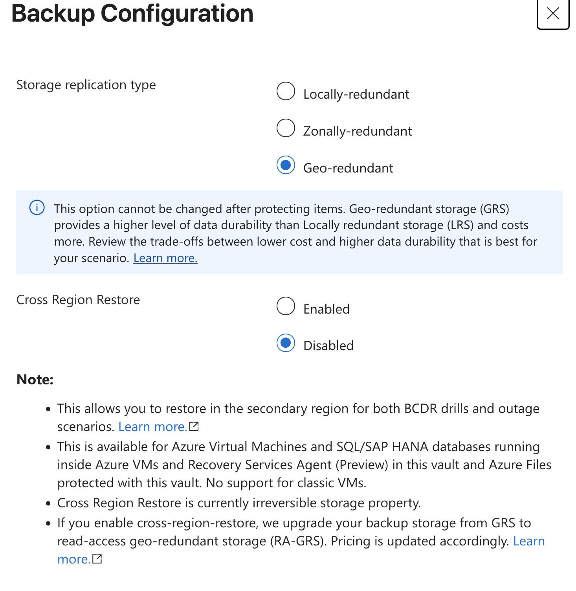
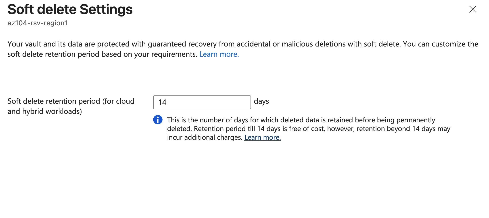

Next, I created a backup policy to backup the VM:

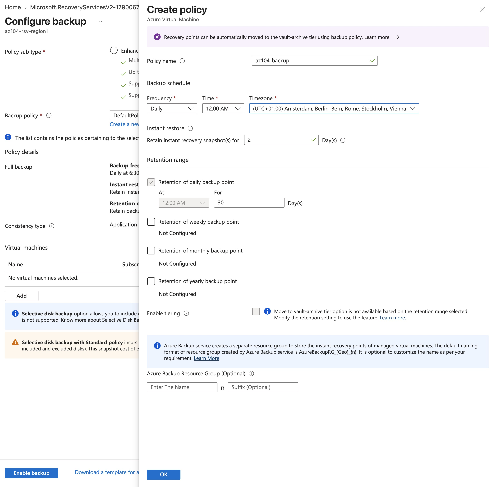

Now one can see the VM under the "Backup Items" of the Recovery Services Vault:

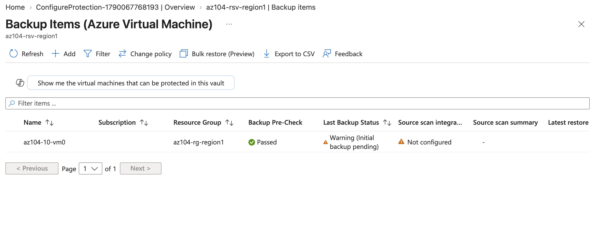


The creation of the Recovery Services Vault created a new resource group `AzureBackupRG_eastus_1`:

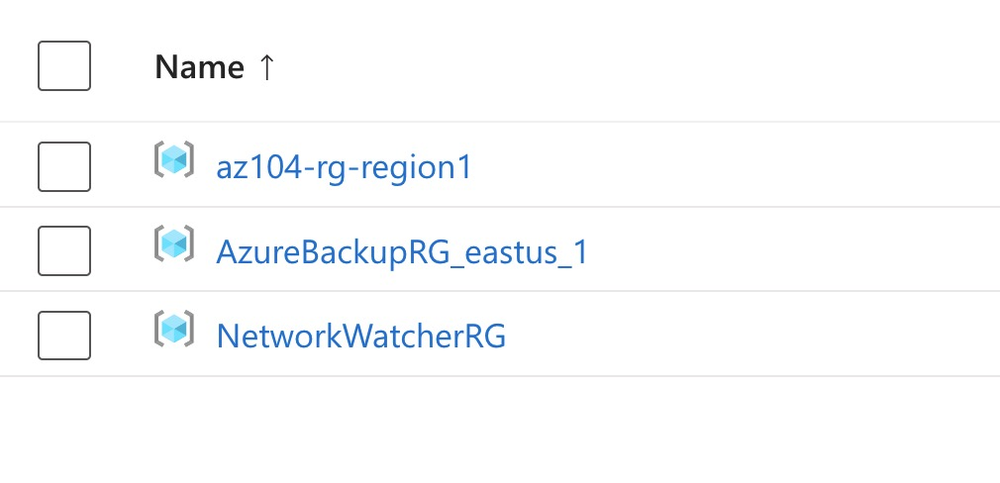

Which contains a Restore Point Collection for the backups:

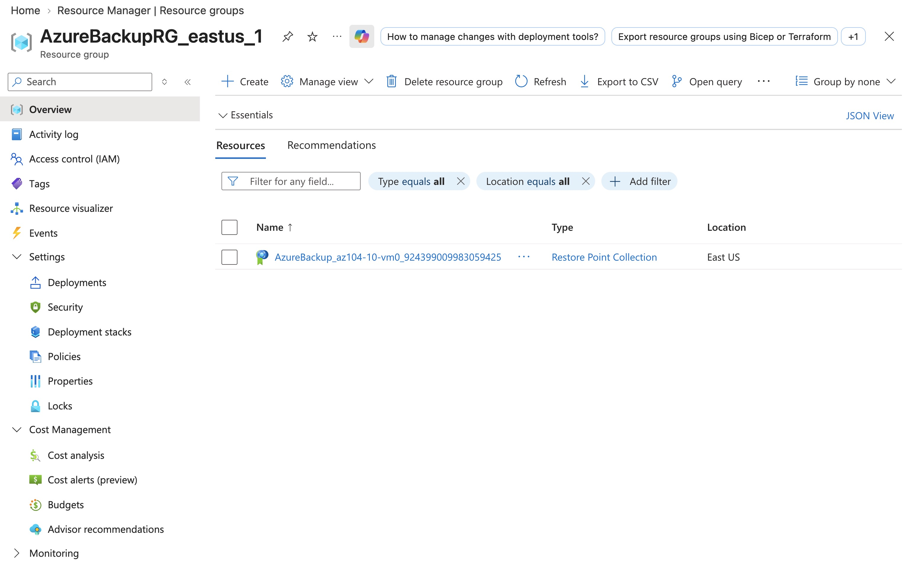


The backup of the VM takes a long while and one can watch it's progress in the Backup Jobs section:

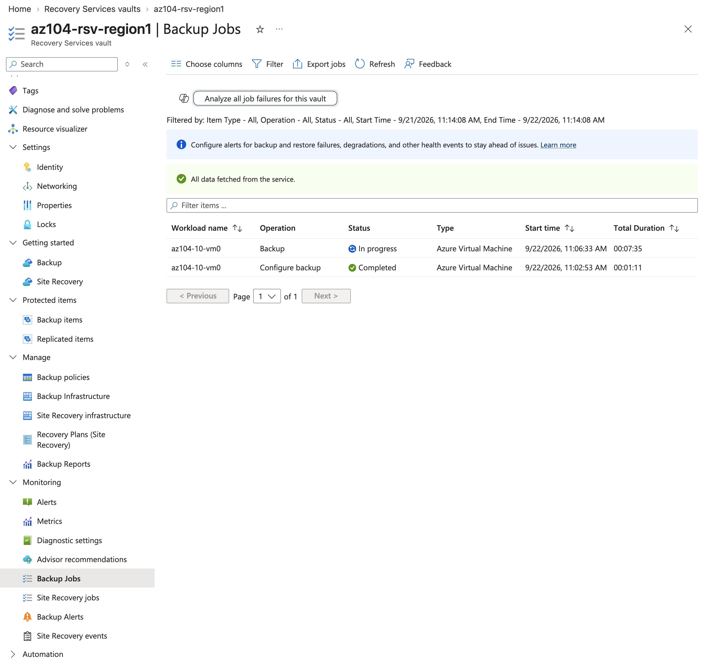

After the backup finished, I tested if the restoration works fine. One can either restore a backup by replacing the currently running VM or create a duplicate VM, which I chose:

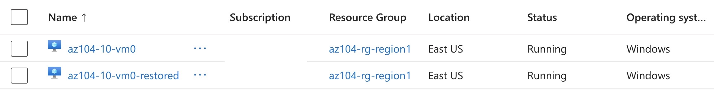


Next, for monitoring, I created a Diagnostic Setting that writes backup and site recovery logs to a storage account. And indeed, the storage account now has containers for those logs:

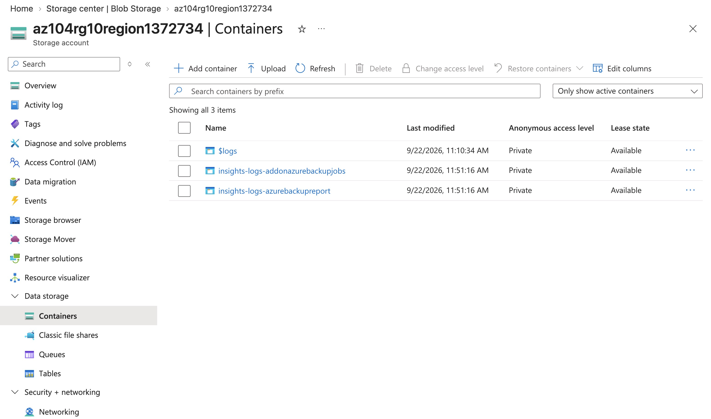


The backup that we set up so far backs up the VM in the same region. For the one bigger recovery option, there is Disaster Recovery, which backs up the VM to a Recovery Services Vault in a different region:

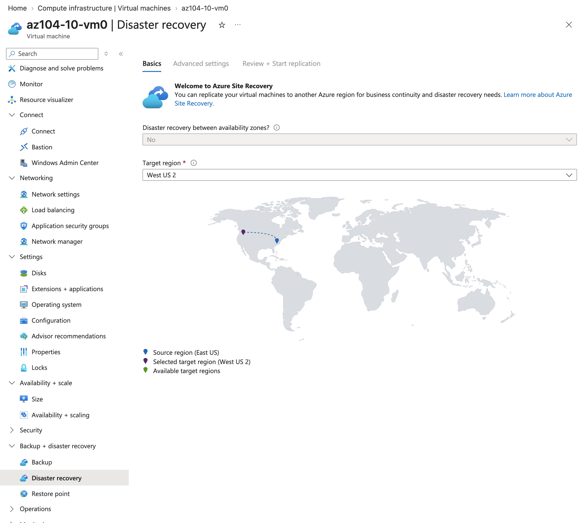
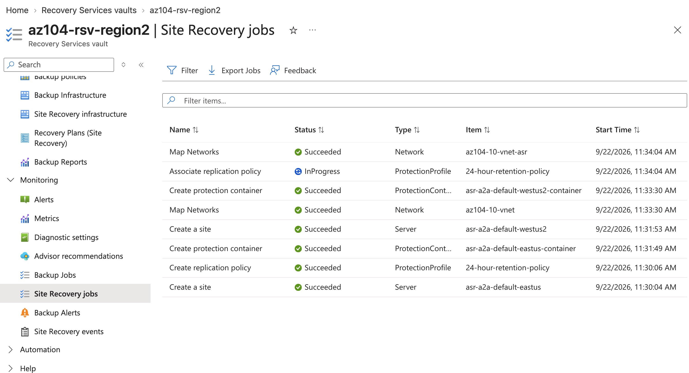

And one can see the VM in the second Recovery Service Vault's `Replicated Items`:

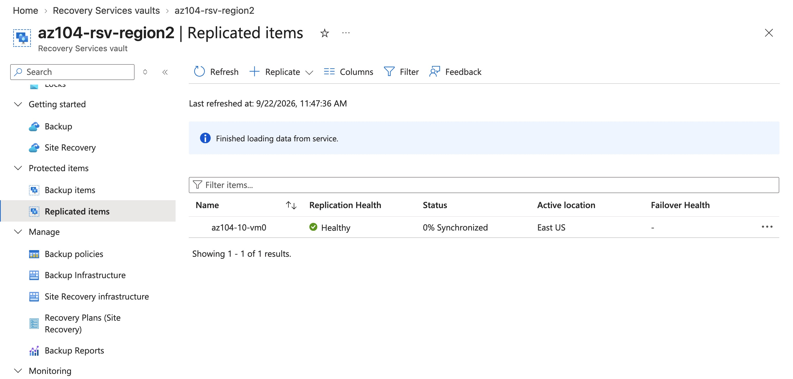

After the Disaster Recovery replication finished, the replicated item in the second RSV looks like this:

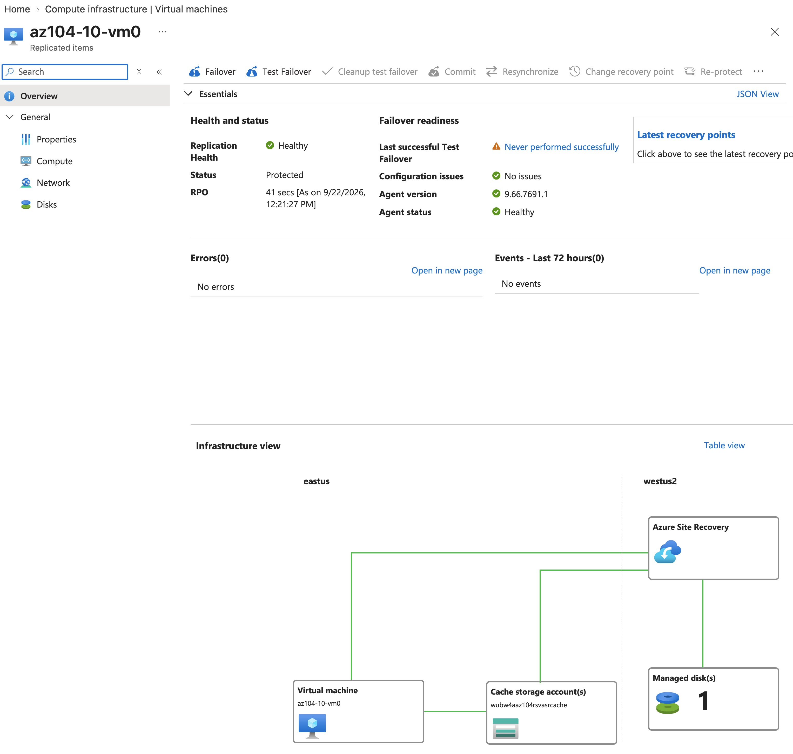

For all backups, it is important to test the actual backup procedure so that one can be certain it works when it has to. Azure offers a Failover Test:

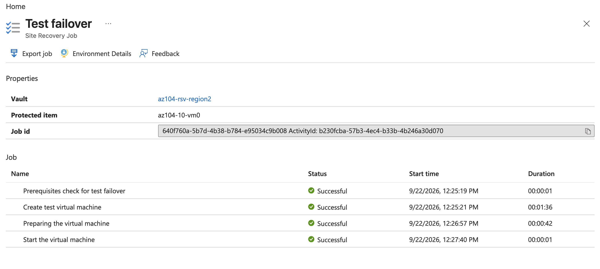


So now we have a regional backup schedule, and a disaster recovery backup schedule into another Azure region, and the backup logs are being archived into a storage account.


## Resources


- [GitHub lab instructions link](https://microsoftlearning.github.io/AZ-104-MicrosoftAzureAdministrator/Instructions/Labs/LAB_10-Implement_Data_Protection.html)


