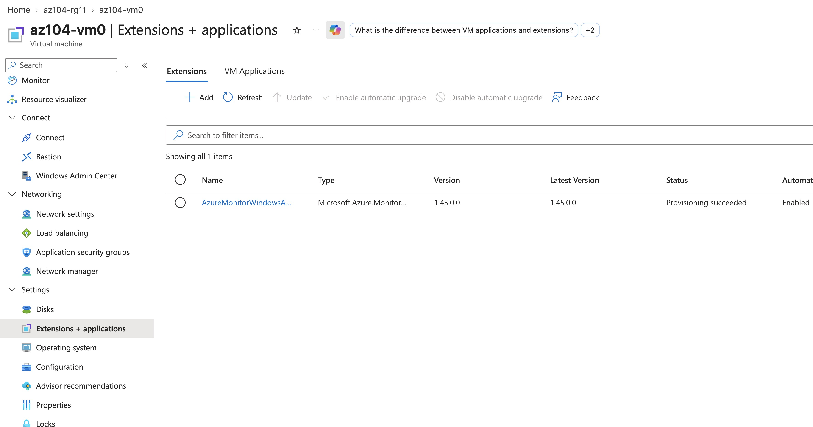
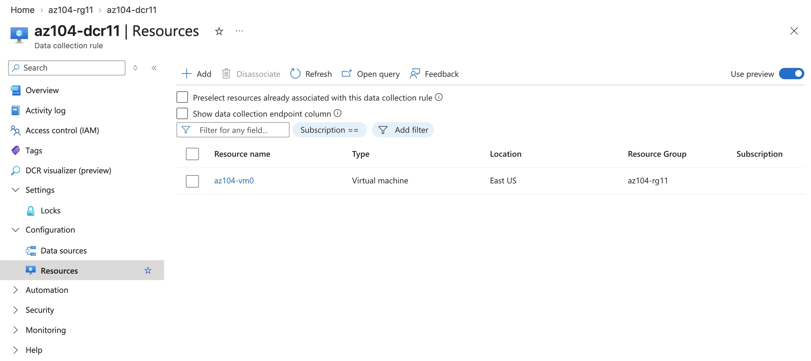
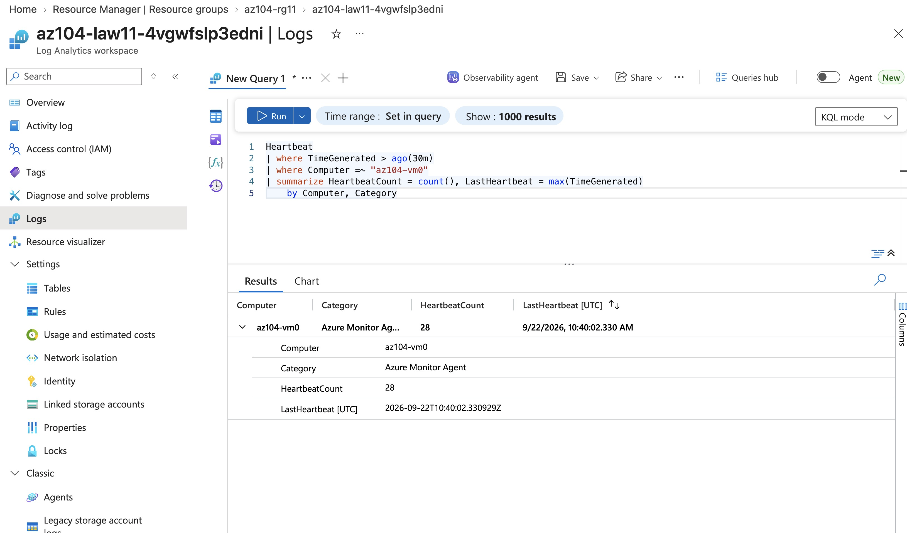
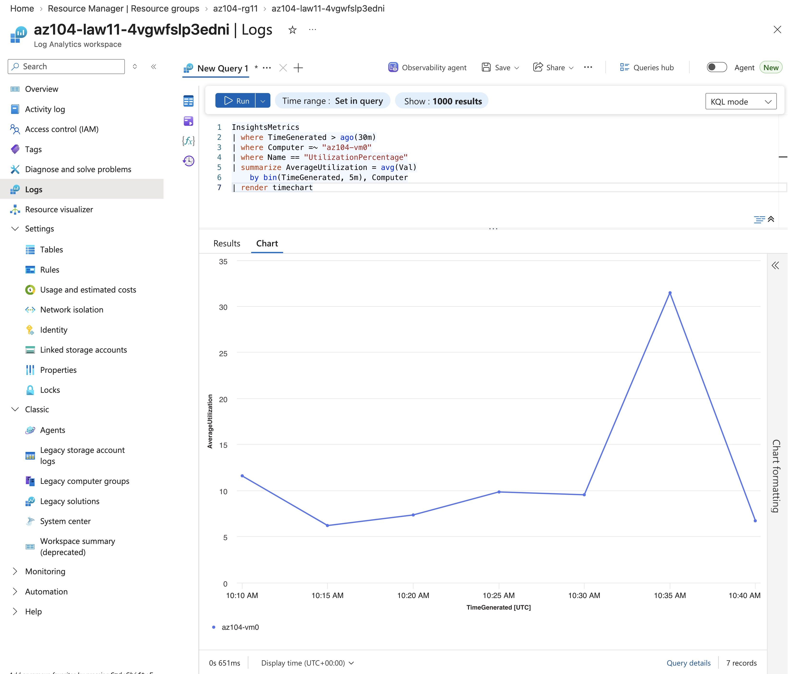
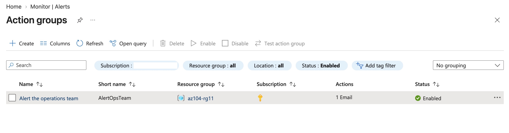
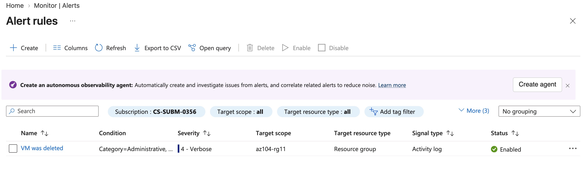
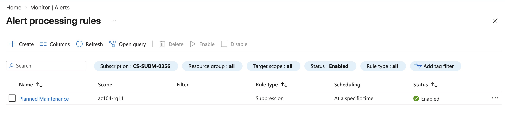
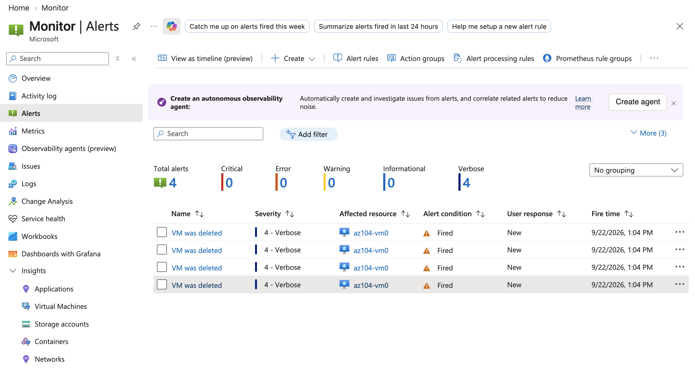

# Lab 11: Implement monitoring

**Certification:** AZ-104  
**Module:** [Lab 11: Implement monitoring](https://microsoftlearning.github.io/AZ-104-MicrosoftAzureAdministrator/Instructions/Labs/LAB_11-Implement_Monitoring.html)  
**Date completed:** 2026-09-23  

## Scenario

> The company runs a business critical app on an Azure VM. So they want to make sure that the operations team gets notified when there are important changes, and that the logs are monitoring logs are available in the log analytics workspace.

## What I Did

The Lab has a json template file to deploy the starting resources. After fixing the "Account Kind Storage is not supported" error, it deployed successfully from the Azure Cloud Shell.

I made sure that the deployed VM had AzureMonitorWindowsAgent enabled in the extensions:

And I confirmed that the Data collection rule was set up correctly for the VM:

In the Log Analytics Workspace, I ran a KQL Query to verify heartbeat logging for the VM:

And verify logging of utilization:

When there are alerts, we want to trigger an action that emails the operation team, so I created an action group for that:

Now I could create an alert rule that is triggered when a VM is deleted and then uses the created action group to email the operations team, i.e. an emali to myself in this case.

Now, when there is a planned maintenance, we want to pause the alerts so I created an alert processing rule that suppresses the alerts during a defined time window:

This planned maintenance window was set to night time, so now we can trigger the alert by deleting the VM, and Azure wants to be extra thorough and created four alerts for this one VM deletion, as seen from the Monitor:

## Gotchas & Learnings

- **Problem:** The depolyment of the template at the beginning of the lab did produce an error: "Account Kind Storage is not supported"  
    **Fix:** Change the template json `"kind": "Storage",` to `"kind": "StorageV2",`  
    **Takeaway:** As always, google or ai-chat the error message
    
    

## Resources

- [GitHub lab instructions link](https://microsoftlearning.github.io/AZ-104-MicrosoftAzureAdministrator/Instructions/Labs/LAB_11-Implement_Monitoring.html)

