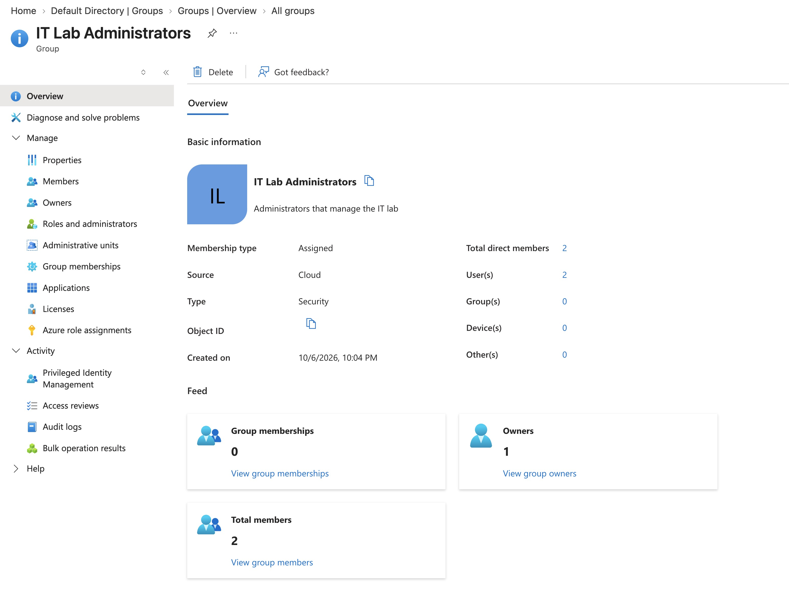
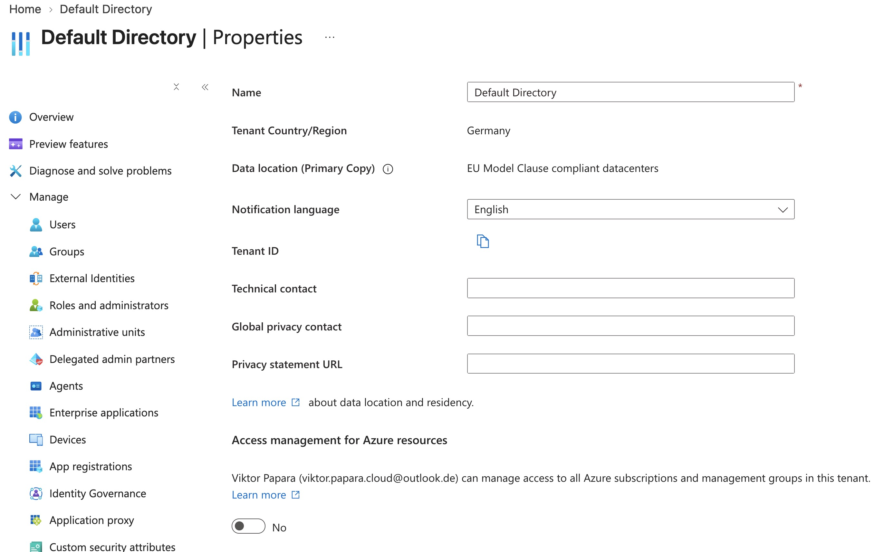

# Lab 01 - Manage Microsoft Entra ID Identities

**Certification:** AZ-104  
**Module:** [Lab 01 - Manage Microsoft Entra ID Identities](https://microsoftlearning.github.io/AZ-104-MicrosoftAzureAdministrator/Instructions/Labs/LAB_01-Manage_Entra_ID_Identities.html)  
**Date completed:** 2026-10-06  

## Scenario

> The company is building a lab environment for pre-production testing. For easier maintenance of the accesses, a group for IT Lab Administrators is created.

## What I Did

In the Entra ID portal, I created a new user account as a tenant member. Then invided an external user with an existing email address outside the Entra tenant.

For easier administration, I created a new security group and added the two accounts there. With that one can manage RBAC roles referring to the security group and new members will automatically get the necessary rights.

Then I checked the data location of the Default directory. Entra is a global service working everywhere, but the data still needs to reside in an appropriate region. For me in Germany, it's important that the data resides in the EU.

## Gotchas & Learnings
    
- **Learning:** The owner of a security group in Entra can be someone who is not in the group itself. At first glance this is weird but makes sense and is very useful. Typically only few accounts have the rights to manage groups, so they will do it for other people without being in the group itself.
    

## Resources

- [GitHub lab instructions link](https://microsoftlearning.github.io/AZ-104-MicrosoftAzureAdministrator/Instructions/Labs/LAB_01-Manage_Entra_ID_Identities.html)

