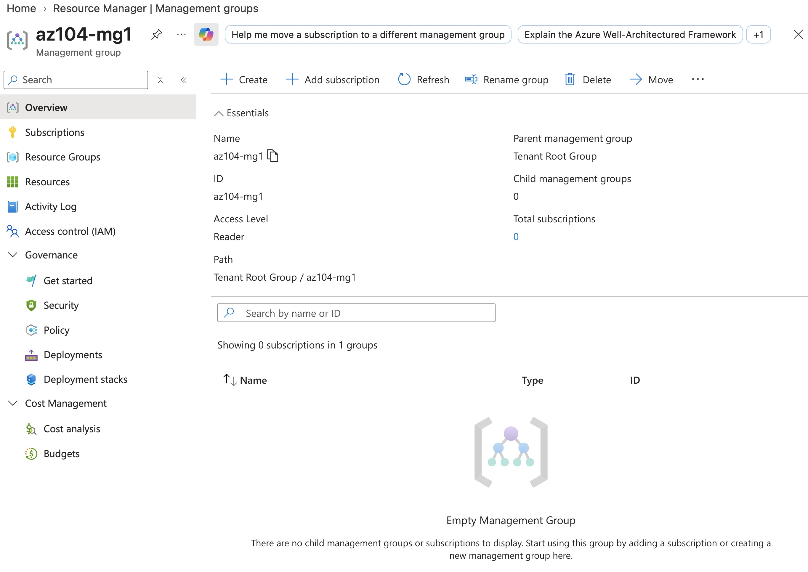
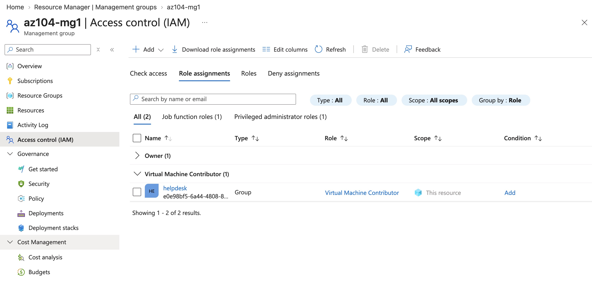
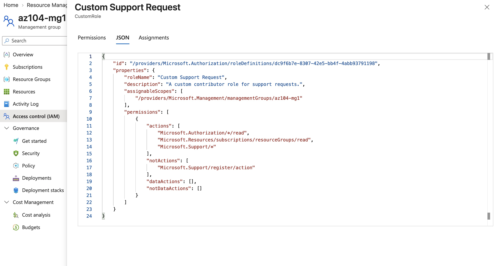
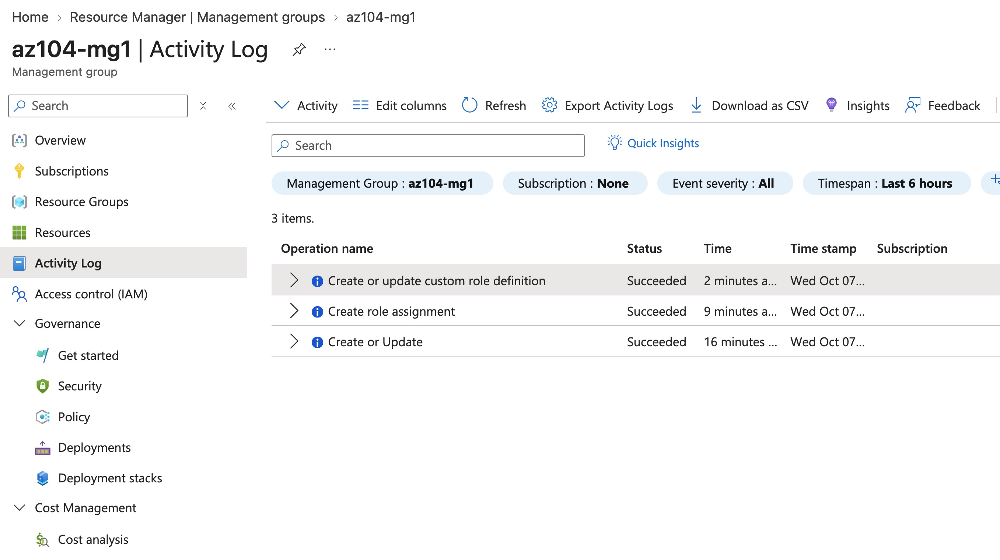

# Lab 02a - Manage Subscriptions and RBAC

**Certification:** AZ-104  
**Module:** [Lab 02a - Manage Subscriptions and RBAC](https://microsoftlearning.github.io/AZ-104-MicrosoftAzureAdministrator/Instructions/Labs/LAB_02a_Manage_Subscriptions_and_RBAC_Entra.html)  
**Date completed:** 2026-10-07  

## Scenario

> In order to better manage governance and roles, the company sets up a management group tree where the subscriptions are organized. This way the company can select which subscriptions certain groups can access.

## What I Did

First, I created a new management group, sitting right below the out of the box "Tenant Root Group"

Then I cretaed a new helpdesk security group and added it to the management group with the role "Virtual Machine Contributor"

Next, I created a custom role Custom Support Request. This can be used to create a role that follows the principle of least privilege where no built-in role offers what is needed.

Finally, I checked in the activity log of the management group and as expected, it has all the operations we made:

    

## Resources

- [GitHub lab instructions link](https://microsoftlearning.github.io/AZ-104-MicrosoftAzureAdministrator/Instructions/Labs/LAB_02a_Manage_Subscriptions_and_RBAC_Entra.html)

