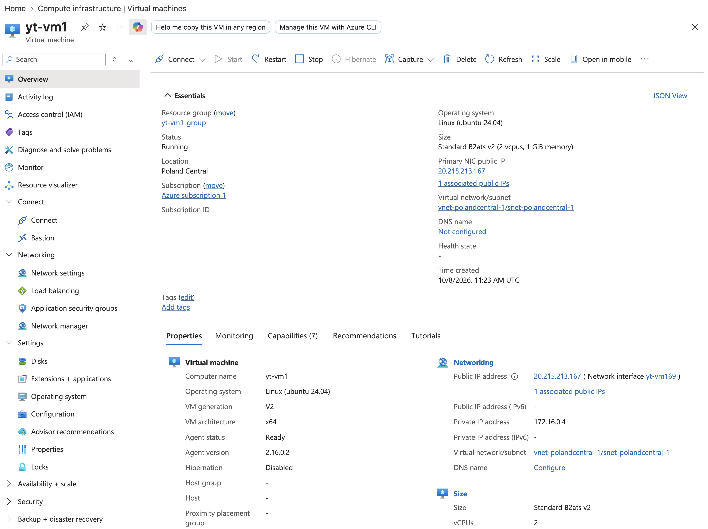
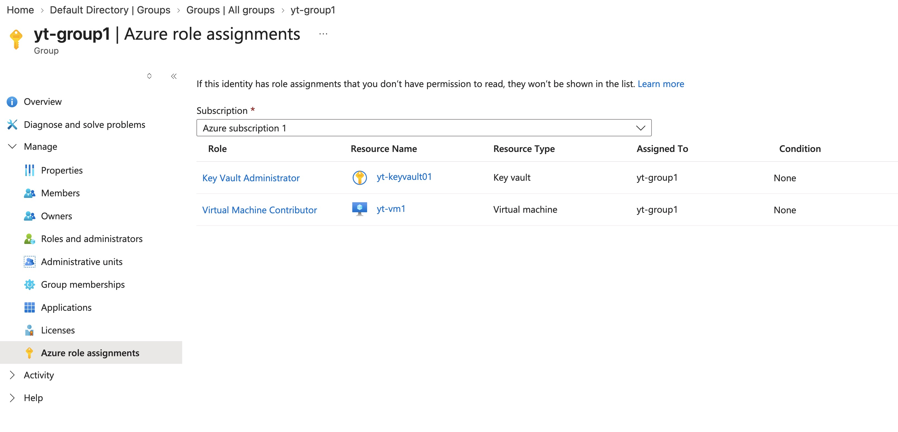
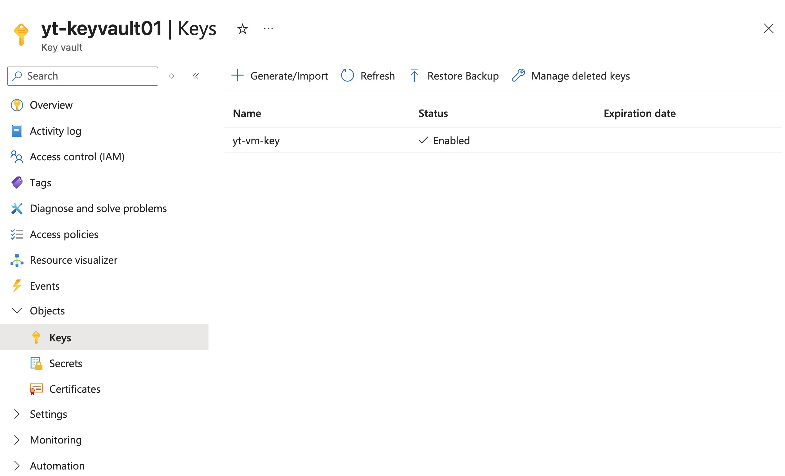
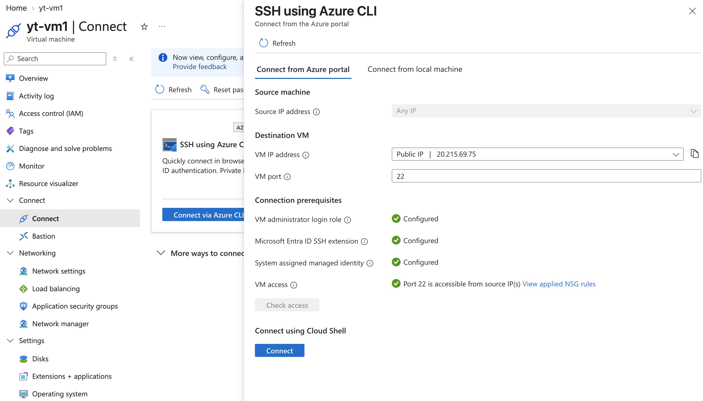
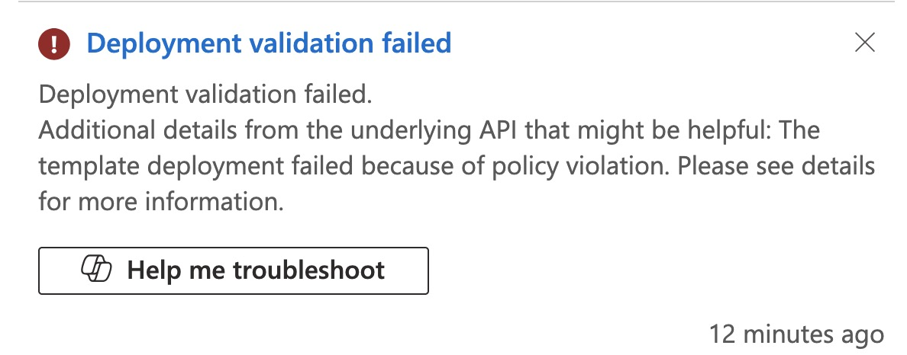
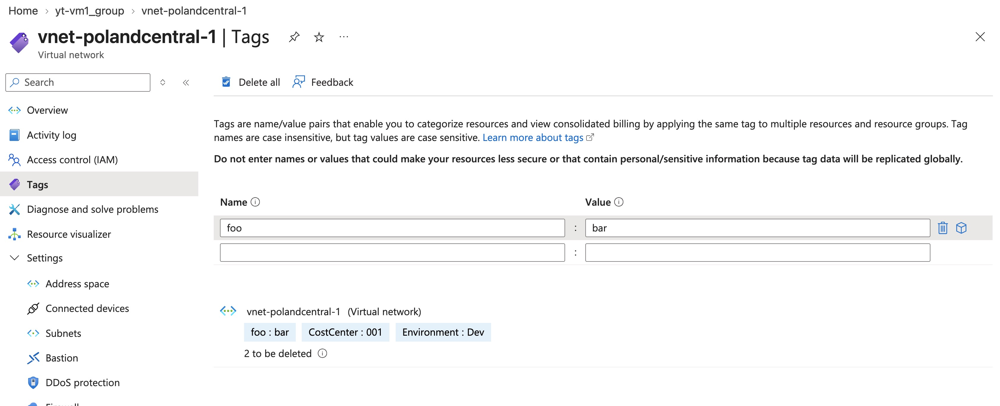
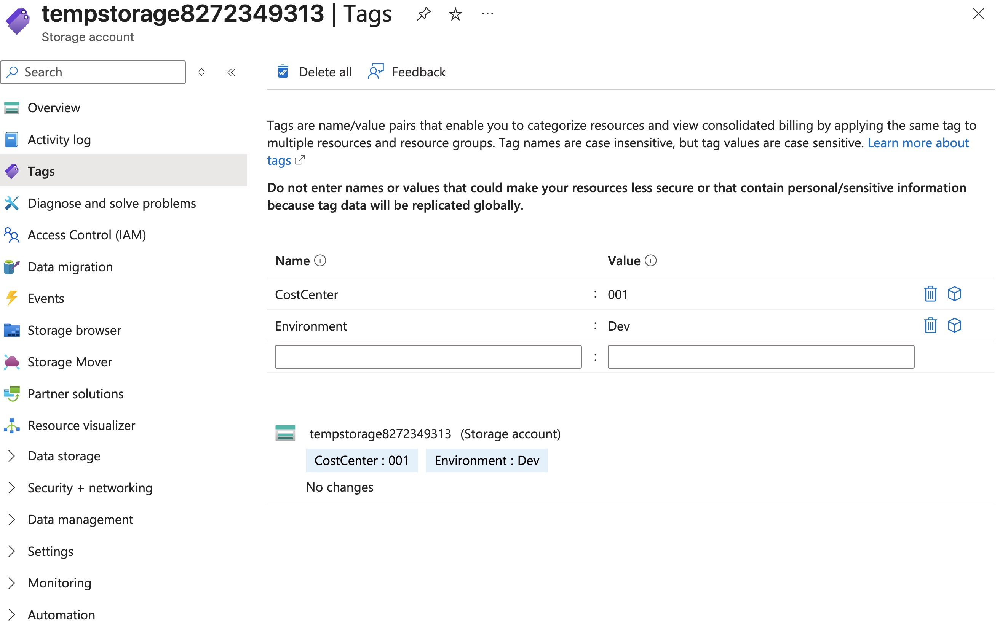
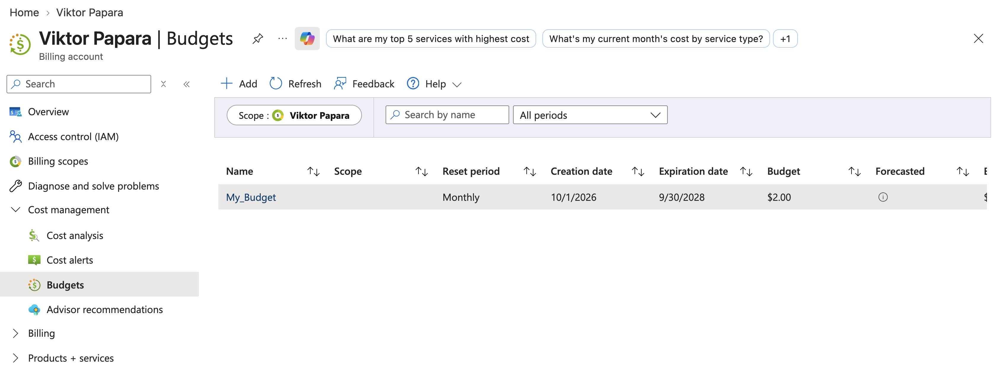

# Youtube Lab: VM, RBAC, Policy, Cost Management

**Certification:** AZ-104  
**Date completed:** 2026-10-08  

## Scenario

> The company wants to host an app on a virtual machine, they need to give access to this machine to the team in a secure way using Entra ID. The company also wants to ensure compliance with an Azure policy and wants to track costs with Budget Alerts.

## What I Did

I created a VM that uses an SSH key for ssh login:

To better manage the access to this vm and others, I created a security group that will hold the neccessary roles:

It has the Key Vault Administrator role so that the people can access the generated SSH key inside a key vault:

There is also another way to access the VM using Entra ID and the Azure Cloud Shell. Azure needs to install some addons but it does that automatically and so one can easily access the VM's shell:

Now I created a policy initiative with policies that let resources inherit certain tags from their resource groups and also limit the allowed resources that can be created to only VMs. When trying to create a vnet, I got an error:

And the inherited tag policy also works now. It is applied when an azure resource gets updated (like adding nonsensical tags):

or when one creates a new resource:

Finally, I created a Budget alert that sends emails when certain cost thresholds are reached:

## Resources

- Lab Recommendation from Youtube Video: https://www.youtube.com/watch?v=yRjcazpYEH4

